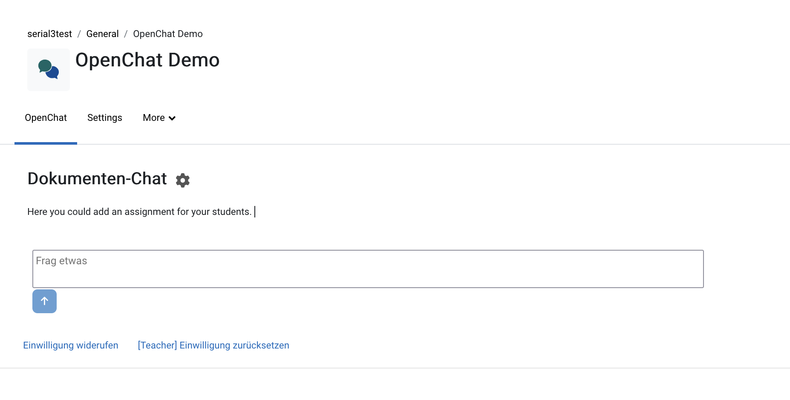

<!--
curl -X POST http://localhost/moodle413/mod/openchat/llm_stream.php -d "model=phi3:latest" -d "prompt=Hello world"  -d "hostname=http://localhost:11434/api/generate"

curl -X POST http://localhost:5000/llm/models/list

-->
<br>
<div align="center">
  
</div>

<br>
<h1 align="center">OpenChat</h1>

## *OpenChat* is a Moodle activity plugin for chatting with open-source large language models.

*openchat* (mod_openchat) is a ready to use Moodle activity plugin that enables students to chat with an open-source large language model. Currently, the plugin is compatible with the API of OpenWebUI (former Ollama). Thus, all models available for [OpenWebUI](https://github.com/open-webui/open-webui) can be selected by the teacher for chat communication of students. 
In addition the plugin supports document chats using Retrieval Augmented Generation (RAG). RAG requires an external webservice providing the document store and handling the retrieval tasks. The RAG implementation is build for [RAG Webservice](https://github.com/catalparesearch/rag-webservice/).
 

<!-- development-related badges -->
[](https://github.com/CATALPAresearch/moodle-mod_openchat/commit-activity)
[](https://github.com/CATALPAresearch/mod_openchat/commit/)
[](https://github.com/CATALPAresearch/mod_openchat/contributors/)
[](https://github.com/CATALPAresearch/moodle-mod_openchat/issues/)
[](http://perso.crans.org/besson/LICENSE.html)


<!-- Maturity-related badges 
see: https://github.com/mkenney/software-guides/blob/master/STABILITY-BADGES.md
-->
[](https://github.com/mkenney/software-guides/blob/master/STABILITY-BADGES.md#alpha)


<!-- AI-related and LA-related badges -->
<!-- 
https://nutrition-facts.ai/

Privacy Ladder Level
Feature is Optional
Model type
Base model
Base Model Trained with Customer Data
Customer Data is Shared with Model Vendor
Training Data Anonymized
Data Deletion
Human in the Loop
Data Retention
Compliance
-->


<br><br>
<p align="center" hidden>
  
</p>

<p align="center">
  <a href="#key-features">Key Features</a> •
  <a href="#how-to-use">How To Use</a> •
  <a href="#download">Download</a> •
  <a href="#credits">Credits</a> •
  <a href="#related">Related</a> •
  <a href="#citation">Citation</a> •
  <a href="#license">License</a>
</p>


## Key Features

**General**
* customizable host url, API end points, and API key.
* (optional) A purely javascript-based interface to OpenWebUI. However, this is not recommended if API is secured by an API key.
* server-side communication between PHP and OpenWebUI API and RAG webservice. 
* minimal user interface
* Teachers can add several instances of OpenChat to a course

**LLM chat**
As a teacher:
* Select a model to be used for the document chat
* API endpoints: 'api/generate', e.g. http://localhost:11434/api/generate, see official [Ollama API documentation](https://github.com/ollama/ollama/blob/main/docs/api.md).

**Document chat (RAG)**
Students can pose questions in the document chat that are answered based on the documents selected by the teacher.

Settings for teachers:
* Select and upload a number of PDF files to be index for RAG
* Chose from the indexed document the ones to be used for the docment chat
* Select a model to be used for the document chat
* Used API endpoints at the RAG Webservice, [see documentation](https://github.com/CATALPAresearch/rag-webservice):
  + /documents/create_index
  + /documents/delete_index
  + /documents/documents_by_course
  + /documents/list
  + /documents/get_index
  + /documents/update_index
  + /llm/models/list
  + /llm/query
  + /llm/query_documents

**Agent Chat**
(currently under development)


## Roadmap
**Roadmap**
General:
* Prompt Templates: As a teachers I would like to define prompt templates that encapsulate student LLM requests. These encapsilations can be used to enrich the prompt with additional instructions or to instruct the LLM to withdraw certain information. 
* Model cards: As a teacher I need a description about the capabilities, limitations, and use cases of the available models in order provide appropriate apprpriate quality of the generated content. 

RAG
* RAG streaming: As a student I would like to resive the document chat responses as a stream of tokens instead of wainting until the response was completely generated.
* Persistent chat history: As a student I would like to browse through past chat sessions to see my previous communication with the LLM/RAG.
* RAG attribution: As a student I would like refrences to the source of information in the document chat responses.

Agent Chat: 
  - Include dialoge templates like select menues, small visualizations, tables, lists, etc.
  - As a student I would like to know how the agents works and what personal data is processed.

nth/nice to have
* Add further language strings and its translations 
* Compatability with LLM servers other then Ollama/OpenWebUI, e.g. ChatGPT
* Model seelction: As a student I want to optionally select the LLM model to be used for my specific needs.


## How To Use

**Prerequisits**
* [Ollama as LLM-Server](https://github.com/ollama/ollama)
* [RAG Webservice](https://github.com/CATALPAresearch/rag-webservice.git)

**Setup**
To clone and run this application, you'll need [Git](https://git-scm.com) and [Node.js](https://nodejs.org/en/download/) (which comes with [npm](http://npmjs.com)) installed on your computer. From your command line:

```bash
# Clone this repository
1. Clone  the repository to /your-moodle/mod/
$ git clone git@github.com:catalparesearch/moodle-mod_openchat.git

# Rename the folder to 'openchat'
$ mv moodle-mod_openchat openchat

# Go into the repository
$ cd openchat

# Install dependencies
$ cd vue
$ npm install

# Build the plugin by transpiling the vue code into javascript
$ npm run build

# Open the page https://<moodle>/admin/index.php?cache=1 and follow the install instructions for the plugin or
$ php admin/cli/uninstall_plugins.php --plugins=mod_openchat --run

# To install the *openchat* plugin afterwards, copy the repository downloaded in the 1. step into the `mod` folder in the folder your Moodle installation is located in replacing the current `mod/openchat` folder containing the regular *Page* plugin. Now, login to your Moodle running as an administrator. The install/update GUI should open automatically. Just follow the steps the GUI presents to you and you should have installed the *openchat* plugin successfully afterwards. As an alternative to using the GUI for installation, you can also run the update script from within the folder of your Moodle installation:
$ php admin/cli/upgrade.php

# Open a Moodle course of you choice and add openchat as an activity to your course.

# Provide a host URL and API key of your OpenWebUI instance.

```


## Download

You can [download](https://github.com/catalparesearch/moodle-mod_openchat/releases/tag/latest) the latest installable version of *OpenChat* for Moodle 3.11. or 4.x.

## Getting Started with Development

The client-side code lives in the `vue/` folder. The root DOM element is defined in `view.php`. Webservices for Moodle database access are declared in `./db/services.php` and implemented in `./ws/`.

See the documentation of the OpenWebUI [API endpoints](https://docs.openwebui.com/getting-started/api-endpoints/). The RAG webservices used for the document chat can be found [here](https://github.com/CATALPAresearch/rag-webservice).


### 🙌 How You Can Help

We're actively looking for contributors to support and improve this project. You can help by:

- 🧪 **Testing** plugin functionality  
- 💡 **Providing feedback** on usability and UX  
- 🌍 **Adding translations** in your language  
- 🚀 **Suggesting or implementing** new features  

Open an [issue](https://github.com/catalparesearch/moodle-mod_openchat/issues) to share ideas, or submit a pull request — we’d love to collaborate!


## Emailware

*openchat* is an [emailware](https://en.wiktionary.org/wiki/emailware). Meaning, if you liked using this plugin or it has helped you in any way, I'd like you send me an email at <niels.seidel@fernuni-hagen.de> about anything you'd want to say about this software. I'd really appreciate it!

## Credits

This software uses the following open source packages:
[vue.js](https://vuejs.org/)

## Related

* [https://moodle.org/plugins/block_openai_chat](block_openai_chat)
* [https://moodle.org/plugins/block_ai_chat](block_ai_chat)
* [https://moodle.org/plugins/tiny_ai](tiny_ai)
* AI subsystem in Moodle v4.5 can use [https://docs.moodle.org/405/en/Ollama](Ollama as an AI API provider)
<!--
https://moodle.org/plugins/local_ai_manager
https://moodle.org/plugins/block_ai_control
-->

## Citation

```
@misc{Seidel2024-OpenChat,
author = {Seidel, Niels},
doi = {},
title = {{OpenChat - Moodle activity plugin for chats with Large Language Models including Retrieval Augmented Generation}},
url = {https://github.com/CATALPAresearch/moodle-mod{\_}openchat},
year = {2025}
}
```

## You may also like ...

...

## License

[GNU GPL v3 or later](http://www.gnu.org/copyleft/gpl.html)


## Contributors
* Niels Seidel [niels.seidl@fernuni-hagen.de](niels.seidl@fernuni-hagen.de)

---
<a href="https://www.fernuni-hagen.de/english/research/clusters/catalpa/"></a>
<a href="https://www.fernuni-hagen.de/"></a>


